# Introduction

The purpose of this lab is to show an end to end example of extracting structured data from unstructured documents (PDF) and leveraging Azure Open AI to query the data.

This sample will provide CI/CD to train a custom model in AI Document Intelligence, index all documents provided in Azure AI Search and call a custom skillsets that will leverage the trained model in AI Document Intelligence.

# Architecture

Here a diagram that represent the architecture deployed in this GitHub repository.

# Prerequisite

- A tenant that have Access to Azure Open AI Service, you can request access [here](https://go.microsoft.com/fwlink/?linkid=2222006&clcid=0x409)

Be sure to select this option:

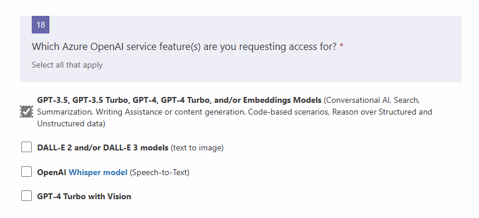

# How to deploy the Azure Resources

First, **fork** this repository

Next, you will need to create some [GitHub repository secrets](https://docs.github.com/en/codespaces/managing-codespaces-for-your-organization/managing-encrypted-secrets-for-your-repository-and-organization-for-codespaces#adding-secrets-for-a-repository).  Here's the list of secrets you will need to create.

| Secret Name | Value | Link
|-------------|-------|------|
| RG_NAME | The name of the resource group to create | 
| AZURE_CREDENTIALS | The service principal credentials needed in GitHub Actions | [GitHub Actions](https://github.com/marketplace/actions/azure-login)
| AZURE_SUBSCRIPTION | The subscription ID where the resources will be created |
| PA_TOKEN | Needed to create a GitHub repository secret within GitHub Actions |  [GitHub Actions](https://github.com/gliech/create-github-secret-action) |
| DATASOURCE_NAME | The name of the datasource that will be created in Azure AI Search, enter: dtorder |
| INDEX_NAME | The name of the index that will be created in Azure AI Search - here enter **order** |
| INDEXER_NAME | The name of the indexer that will be created in Azure AI Search - here enter **indexer** |

## Run Create Azure Resources GitHub Actions workflow

Now you can go to the Actions tab 

You will see this message

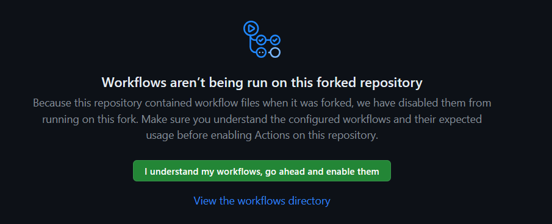 

Click the **green button** to confirm.

Now, run the **Create Azure Resources** [GitHub Actions](https://docs.github.com/en/actions).

To do so, in the right you see a gray button called **Run workflow**, click on it and click on the **green button**.

Once the GitHub Actions workflow finishes, you should see these Azure resources in your **resource group**

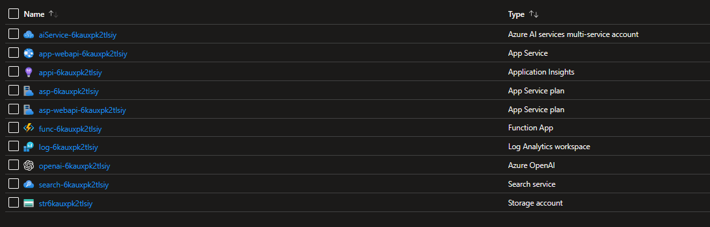

## Upload training assets

In the GitHub repository, you will see a folder called samples

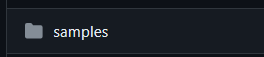

Click on it, and now you will see a folder called **training-assets**

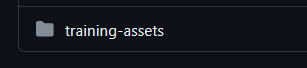

You need to upload all the files present in this folder to your Azure Storage created when you ran the **GitHub Actions workflow**.

Be sure to **clone** the GitHub repository on you local machine so you can upload easily the files.

Now, in you **resource group** in Azure, click on the **Storage Account**

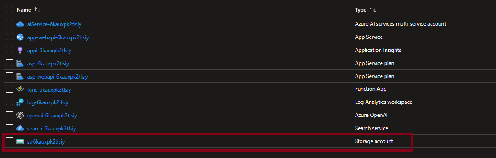

In the left menu click on **Containers**

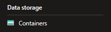

Click on the trainingassets one

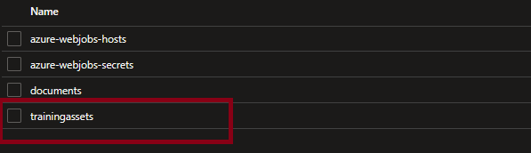

Now upload all the documents there, it should look like this:

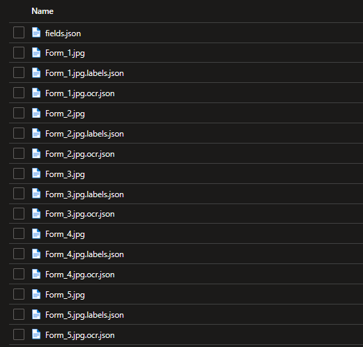

## Create New GitHub Secrets

Now, before training the model, you need to create 3 new secrets

Go back in your **resource group** in Azure.  Click on the resource of type **Azure AI services multi-service account**.

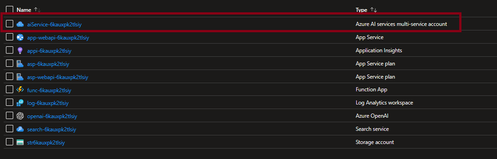

In the left menu click **Keys and Endpoint**

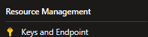

Now, be sure to copy the **endpoint** and the **KEY 1**

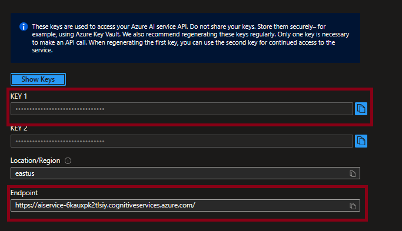

Now, go create two **GitHub Secrets**

| Secret Name | Value | Link
|-------------|-------|------|
| FORM_RECOGNIZER_ENDPOINT | The endpoint copied | 
| FORM_RECOGNIZER_API_KEY | The KEY 1 copied |

Now, we need to create one last **GitHub Secret**, go back to your **Storage Account**.

In the left menu click **Access keys**

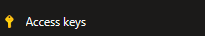

Be sure to copy the **connection string**, you will need to click on the button **Show**

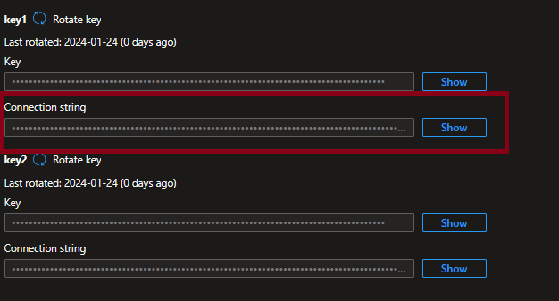

Now create a new GitHub Secret

| Secret Name | Value | Link
|-------------|-------|------|
| STORAGE_CNX_STRING | The connection string copied before | 

Your secrets should look like this
        
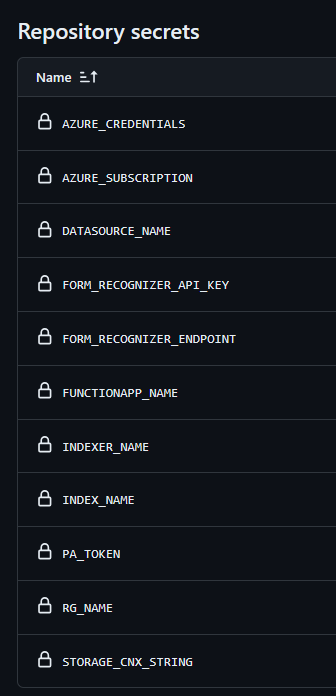

## Train the model

Now, you are ready to train the custom model in Azure AI Document Intelligence.  Go to your GitHub Actions and run the one called **Train document intelligent model**.

# Deploy the Azure Function

For indexing the document we need to deploy the Azure Function that contains the custom skillset.

To do this, run the **GitHub Actions workflow** called **Deploy Azure Function**

# Create Azure Search Index and Indexing

Now it's time to create the index and indexer in Azure AI Search.  But first, we need to upload the document we need to index.

Go back in the **GitHub repository**, you should have cloned it by now.

In the folder called **samples**, you will see another folder called **indexing-documents**

Go back to your **Azure Storage** and upload those files in the **documents** container.

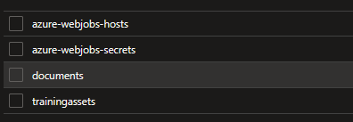

Upload all the files, it should look like this

## Create 4 new GitHub Secrets

Now we need to create 4 new **GitHub Secrets**.

First, go back to the Azure Portal in the resource group and click on the Search Service.

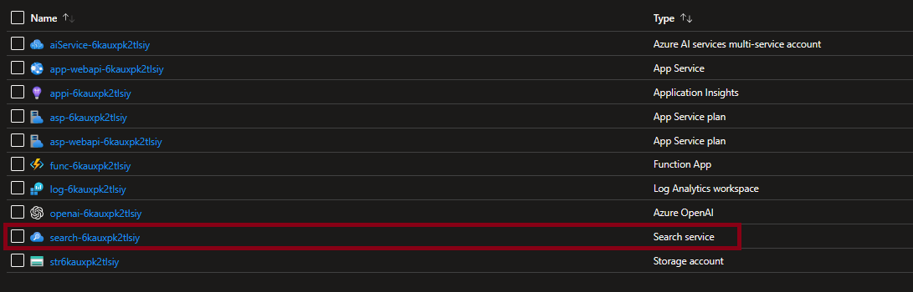

Copy the value of the URL

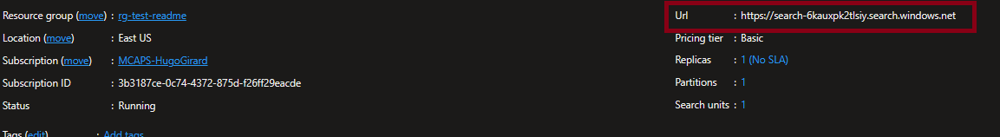

Next, click in the left menu in **Key**

Copy the primary admin key

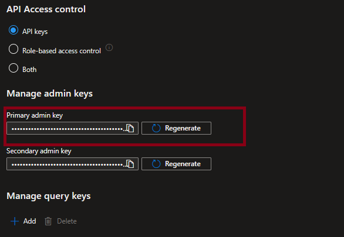

Now create 3 new secrets

| Secret Name | Value | Link
|-------------|-------|------|
| AISEARCH_VERSION | 2023-11-01 | 
| AISEARCH_ENDPOINT | The endpoint copied before | 
| AISEARCH_APIKEY | The key copied before | 

Finally, you need to create one last secret, in the **resource group** click on the **function**.

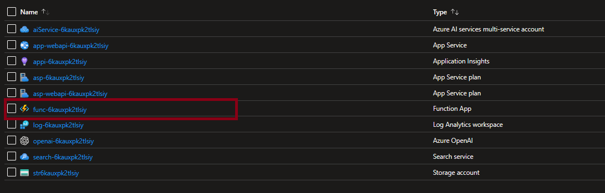

You will see 4 functions there, click on **AnalyzeNodel**

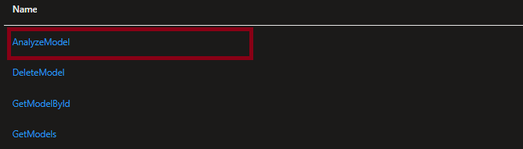

Now, click the **Get Function Url** and copy the value of the URL.

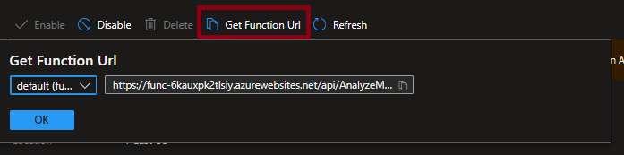

Now you can create the last GitHub Secret

| Secret Name | Value | Link
|-------------|-------|------|
| FUNCTION_URL | URL of the function | 

## Index documents

Now, you can run the **Github Action workflow** called **Create indexing**

## Now deploy the Bot Web App

Now, you can run the **Github Action worflow** called **Deploy Chat**

## Test the application

You can test the application by using queries such as these:
- What's the date of PO 852159?
- What's the phone number of Nourish Groceries?
- How many orders are above 500$?
- What items are on PO 852159?

# REST API Azure Search Data Plane

https://learn.microsoft.com/en-us/rest/api/searchservice/operation-groups?view=rest-searchservice-2023-11-01
